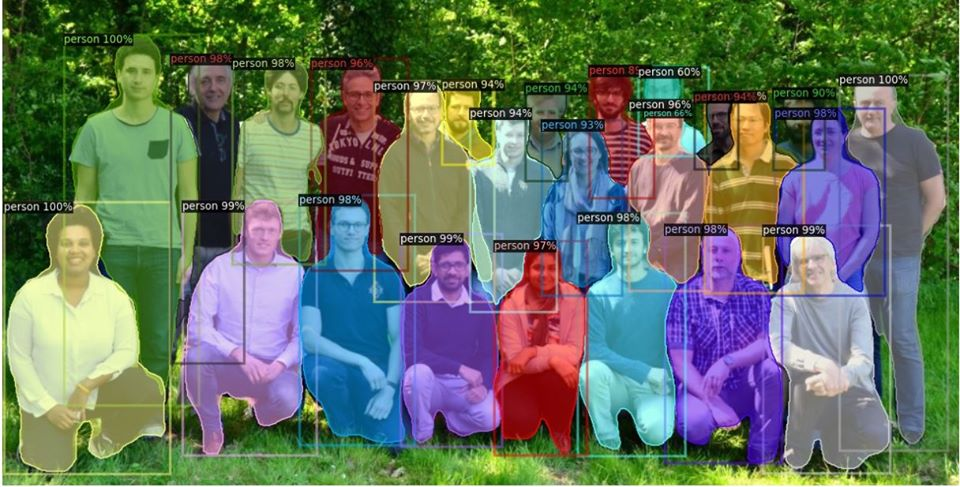

<h1 align="center">Facebook's Detectron2_Demo_Windows_10</h1>
This repo contains the process of getting started with Facebook FAIR's detectron2 project on windows 10 without any Nvidia GPU.
<a href="#">
  

    
  

</a>
